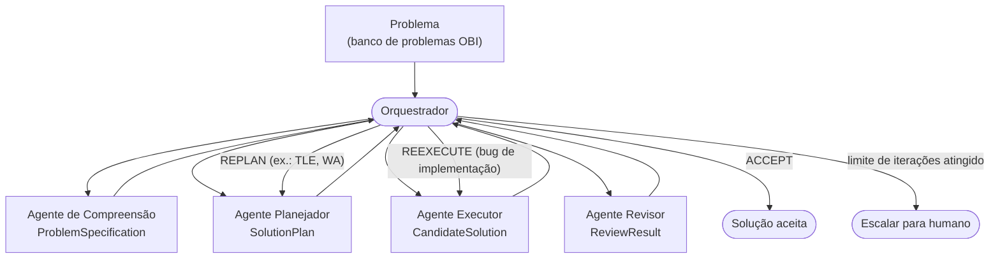

<div align="center">
<h1>polya-multiagent</h1>
</div>

<p align="center">
<em>Um sistema multiagente que aplica explicitamente o método de resolução de problemas de George Pólya — compreender, planejar, executar, revisar — para avaliar e melhorar a capacidade de LLMs/MLLMs de resolver problemas de programação competitiva da Olimpíada Brasileira de Informática (OBI).</em>
</p>

<p align="center">
Pesquisa conduzida no <a href="https://ic.ufal.br">Instituto de Computação da Universidade Federal de Alagoas (IC/UFAL)</a>, organização <a href="https://github.com/GEMA-LAB">GEMA-LAB</a>.
</p>

---

## Sobre o projeto

Um estudo anterior deste grupo avaliou LLMs em problemas de programação
competitiva da OBI (1999–2025) usando um pipeline simples: um agente
gerador de código recebe o enunciado (texto e, opcionalmente, imagens) e
devolve diretamente uma solução, em *prompting* zero-shot — "resolva
isso", sem nenhuma etapa intermediária de raciocínio estruturado. O
resultado mostrou uma limitação recorrente: problemas difíceis, sobretudo
de grafos e programação dinâmica, exigem identificar corner cases, modelar
o problema corretamente e planejar a solução *antes* de codificar — um
passo que o *prompting* zero-shot simplesmente pula.

Este repositório é a continuação direta desse trabalho: em vez de pedir
"resolva isso" a um único agente, decompõe o processo de resolução nas
quatro etapas do método de Pólya (*"A Arte de Resolver Problemas"*, 1945),
cada uma implementada como um agente auditável e testável, coordenados por
um Orquestrador. A pergunta de pesquisa central é:

> A decomposição do processo de resolução de problemas de programação
> competitiva segundo as etapas de Pólya melhora a taxa de resolução de
> LLMs, em comparação com *prompting* zero-shot direto?

O desenho do repositório já deixa preparado o caminho para responder isso
por *ablation*: medir o efeito de cada etapa isoladamente (baseline →
+compreensão → +planejamento → +revisão → sistema completo com ciclo de
feedback iterativo), em vez de só comparar "com Pólya" contra "sem Pólya"
como uma caixa preta.

## Arquitetura



O fluxo **não é linear** — um resultado de revisão pode mandar de volta
para o planejamento (replanejar a estratégia) ou para a execução (só
corrigir um bug de implementação, mantendo o plano). Ver
[`docs/agentes/visao-geral.md`](docs/agentes/visao-geral.md) para a
justificativa técnica completa dessa arquitetura, incluindo os critérios
de engenharia que definem o que torna cada componente um *agente* (e não
apenas uma chamada de LLM encapsulada em uma função).

### Status de implementação

Este é um repositório de pesquisa em andamento — nem todos os componentes
do desenho acima existem em código ainda. Esta tabela é a fonte de
verdade sobre o que está pronto:

| Componente | Etapa de Pólya | Status | Documentação |
|---|---|---|---|
| Agente de Compreensão | 1. Understand the problem | Fundido dentro do Agente Planejador | [`docs/agentes/agente-compreensao.md`](docs/agentes/agente-compreensao.md) |
| **Agente Planejador** | 2, 3 (pseudocódigo) e 4 (do plano) | ✅ **Implementado** (`PlaninngAgent`) | [`docs/agente-planejador/`](docs/agente-planejador/) |
| Agente Executor (Codificador) | 3. Carry out the plan (código real) | Não implementado | [`docs/agentes/agente-execucao.md`](docs/agentes/agente-execucao.md) |
| Agente Revisor | 4. Look back (pós-execução) | Não implementado | [`docs/agentes/agente-revisao.md`](docs/agentes/agente-revisao.md) |
| Orquestrador | coordenação entre agentes | `main.py` é um script de demonstração linear, não uma máquina de estados real | [`docs/agentes/visao-geral.md#o-orquestrador`](docs/agentes/visao-geral.md#o-orquestrador) |
| Judge (compilação/execução contra casos de teste) | — | Não implementado | — |
| Banco de problemas OBI (dataset com casos de teste oficiais) | — | Não incluído neste repositório | — |

O único componente com implementação e testes completos hoje é o
**Agente Planejador**, que já sozinho ataca a limitação identificada no
estudo original: mesmo sem Agente Executor e Judge, ele produz um plano
estruturado — estratégia algorítmica, complexidade estimada, corner cases,
pseudocódigo, riscos — auditável e pronto para ser injetado no prompt de
geração de código.

## Documentação

Toda a documentação além deste README vive em [`docs/`](docs/), separada
por tipo de necessidade:

| Documento | Do que trata |
|---|---|
| [`docs/metodologia-polya.md`](docs/metodologia-polya.md) | O método de Pólya em si (as quatro etapas, as perguntas-guia de cada uma, as heurísticas de planejamento) — independente de como ele é implementado aqui. |
| [`docs/agentes/visao-geral.md`](docs/agentes/visao-geral.md) | Critérios técnicos de agente, arquitetura multiagente completa, contratos entre agentes, o papel do Orquestrador. Comece por aqui. |
| [`docs/agentes/agente-compreensao.md`](docs/agentes/agente-compreensao.md) | Especificação do Agente de Compreensão (etapa 1 de Pólya). |
| [`docs/agentes/agente-planejador.md`](docs/agentes/agente-planejador.md) | Resumo do Agente Planejador, com atalhos para a documentação completa abaixo. |
| [`docs/agentes/agente-execucao.md`](docs/agentes/agente-execucao.md) | Especificação do Agente Executor/Codificador (etapa 3 de Pólya, código real). |
| [`docs/agentes/agente-revisao.md`](docs/agentes/agente-revisao.md) | Especificação do Agente Revisor pós-execução (etapa 4 de Pólya, sobre o resultado). |
| [`docs/agente-planejador/visao-geral.md`](docs/agente-planejador/visao-geral.md) | Por que o Agente Planejador existe, diagrama do pipeline, mapeamento das 4 etapas de Pólya e das características de agente inteligente em código. |
| [`docs/agente-planejador/interface.md`](docs/agente-planejador/interface.md) | Referência: schema completo de entrada/saída do Agente Planejador, com tipos e exemplos reais de payload. |
| [`docs/agente-planejador/exemplos.md`](docs/agente-planejador/exemplos.md) | Dois exemplos ponta a ponta (problema fácil sem imagem; problema de grafos com imagem) rodados contra o código real. |
| [`docs/agente-planejador/integracao.md`](docs/agente-planejador/integracao.md) | Como o Orquestrador chama o Agente Planejador, como o plano é injetado no prompt do Agente Executor, e o ciclo de feedback com o Judge. |

## Pré-requisitos

- Python 3.14 ou mais recente.
- [uv](https://docs.astral.sh/uv/) instalado — gerencia o ambiente
  virtual e as dependências do projeto.
- Uma API key de um provedor compatível com a API da OpenAI (ex.:
  [OpenRouter](https://openrouter.ai/keys)), necessária para qualquer
  etapa que chame um LLM.

## Instalação

```bash
uv sync --all-groups
```

Copie o arquivo de exemplo de variáveis de ambiente e preencha sua chave:

```bash
cp .env.example .env
```

`MODEL`, `API_KEY` e `BASE_URL` configuram o provedor padrão usado pelos
agentes. Opcionalmente, `PLANNER__API_KEY`/`PLANNER__BASE_URL`/
`PLANNER__MODEL_NAME`/`PLANNER__INPUT_PRICE`/`PLANNER__OUTPUT_PRICE`
permitem apontar o Agente Planejador para um provedor/modelo diferente do
padrão (ex.: mais barato, já que ele faz 4 chamadas de LLM por problema) —
ver [`docs/agente-planejador/integracao.md`](docs/agente-planejador/integracao.md#variáveis-de-ambiente)
para a referência completa.

## Como rodar

```bash
uv run python main.py
```

Isso roda o script de demonstração do pipeline atual: monta um
`PlannerInput` de exemplo, chama o Agente Planejador, e imprime o plano
estruturado e o prompt final que seria enviado ao (ainda não
implementado) Agente Executor — ver
[`docs/agente-planejador/exemplos.md`](docs/agente-planejador/exemplos.md)
para exemplos completos, incluindo um problema de grafos com imagem.

### Testes

```bash
uv run pytest
```

Os testes usam um cliente de LLM falso, injetado por dependência
(`PlaninngAgent(llm=...)`) — nenhum teste depende de rede ou de uma API
key real.

## Estrutura do repositório

```
agents/
  comprehension_agent/   # não implementado (ver docs/agentes/agente-compreensao.md)
  plannig_agent/          # Agente Planejador -- implementado
    main.py                # PlaninngAgent: as 4 etapas de Pólya, uma por método privado
    schemas.py              # contrato tipado de entrada/saída (dataclasses)
    prompts.py               # templates de prompt por etapa
    errors.py                 # exceções específicas do agente
  executation_agent/      # futuro Agente Executor/Codificador -- não implementado
  review_agent/            # futuro Agente Revisor -- não implementado
services/
  llm_service.py           # wrapper fino sobre o SDK da OpenAI (texto, imagens, custo/tokens)
prompt_templates/
  coder_prompt.py           # injeta o plano do Agente Planejador no prompt do Agente Executor
tests/                      # pytest, com stub de LLM injetado por dependência
docs/
  agentes/                  # especificação de cada agente (I/O, funcionamento, métricas)
  agente-planejador/        # documentação completa do único agente implementado
main.py                     # script de demonstração do pipeline (não é o Orquestrador final)
```

## Como citar

Ainda não há uma publicação formal associada a este repositório. Até lá,
cite apontando para este repositório e sua URL
(`https://github.com/GEMA-LAB/polya-multiagent`).

## Licença

Este repositório ainda não define uma licença formal (nenhum arquivo
`LICENSE`). Até que uma seja adicionada, todos os direitos permanecem
reservados aos autores.
