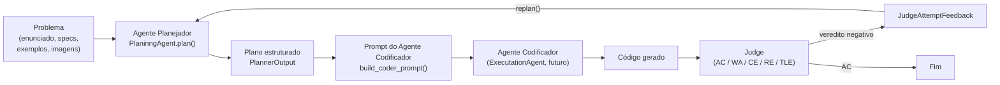

# Visão geral do Agente Planejador

## O que é e por que existe

O `polya-multiagent` avalia LLMs/MLLMs em problemas de programação da OBI. O
estudo original usava um único agente de codificação em modo *zero-shot*:
recebe o enunciado (texto + imagens opcionais) e devolve direto uma solução
em código. Esse formato falha sistematicamente em problemas difíceis
(grafos, programação dinâmica) porque pula justamente as etapas que
diferenciam uma solução correta de uma tentativa às cegas: modelar o
problema, escolher um algoritmo compatível com os limites, e verificar
corner cases antes de escrever qualquer linha de código.

O **Agente Planejador** (`PlaninngAgent`, em
[`agents/plannig_agent/`](../../agents/plannig_agent/)) preenche essa lacuna.
Ele fica entre a seleção do problema e o Agente Codificador, aplica
explicitamente as quatro etapas de George Pólya como estágios distintos e
auditáveis (uma chamada de LLM por etapa, cada uma com uma saída tipada
própria — ver [`schemas.py`](../../agents/plannig_agent/schemas.py)), e
entrega um plano estruturado pronto para ser injetado no prompt de geração
de código.

> Nota sobre o código-fonte encontrado no repositório: quando este trabalho
> começou, `agents/` já continha quatro classes vazias —
> `ComprehensionAgent`, `PlaninngAgent`, `ExecutationAgent`, `ReviewAgent` —
> uma para cada etapa de Pólya. Isso não é uma coincidência do artigo; é a
> estrutura que este trabalho preenche. Implementamos por completo apenas
> `PlaninngAgent` (o Agente Planejador propriamente dito, com as 4 etapas
> internas). As outras três classes continuam como estavam; seu escopo
> futuro está descrito em [`docs/agentes/`](../agentes/), um documento por
> agente. O nome `PlaninngAgent` (e o diretório `plannig_agent`) mantém o typo já
> presente no repositório — não foi corrigido para minimizar o diff fora do
> escopo pedido.

## Onde ele entra no pipeline

Hoje o repositório não tem um Judge nem um Agente Codificador
implementados — apenas o serviço genérico de LLM
(`services/llm_service.py`). O Agente Planejador já está pronto para ser
consumido por eles: `PlannerOutput.to_prompt_section()` gera o bloco
Markdown "## Plano de Resolução" e
`prompt_templates/coder_prompt.py::build_coder_prompt()` o injeta no prompt
final antes da instrução de gerar código (ver
[`integracao.md`](integracao.md)).

## As quatro etapas de Pólya, uma a uma

Cada etapa é um método privado de `PlaninngAgent` (em `main.py`), com seu
próprio prompt (`prompts.py`) e sua própria saída tipada (`schemas.py`).
Nenhuma etapa reaproveita o texto bruto do modelo de outra etapa sem
estruturá-lo primeiro — o encadeamento é feito nos campos tipados, não em
concatenação de texto solto.

| Etapa de Pólya | Método | Prompt | Saída |
|---|---|---|---|
| 1. Compreender o problema | `_understand()` | `build_understanding_prompt()` | `ProblemUnderstanding` (reformulação, entrada/saída, restrições, elementos visuais, ambiguidades) |
| 2. Elaborar um plano | `_devise_plan()` | `build_planning_prompt()` | `SolutionPlan` (padrão algorítmico, estratégias candidatas, estratégia escolhida + justificativa, complexidade, corner cases) |
| 3. Executar o plano | `_carry_out_plan()` | `build_execution_prompt()` | `ExecutionSketch` (pseudocódigo, estruturas de dados, passos-chave) |
| 4. Revisar / Look back | `_look_back()` | `build_review_prompt()` | `PlanReview` (riscos, checklist de verificação, confiança) |

A etapa 3 produz **pseudocódigo**, não código-fonte final — isso continua
sendo responsabilidade do futuro Agente Codificador.

## Checagens determinísticas (código, não LLM)

Depois das 4 chamadas de LLM, `plan()` roda `_apply_deterministic_checks()`,
que sustenta três critérios de qualidade do plano com sinais **calculados
em código**, não apenas auto-relatados pelo modelo — porque pedir pro
próprio LLM avaliar sua própria saída ("dê uma nota de confiança") tende a
ser otimista demais. Os três alimentam `PlanReview` e, se qualquer um
falhar, `review.confidence` é forçado para `"low"` independentemente do
que o LLM tinha dito na etapa 4:

| Critério | Mecanismo | Método |
|---|---|---|
| Algoritmo correto | Compara, em código, a saída que o modelo alega que o pseudocódigo produziria (`ExecutionSketch.traced_outputs`, obtida pedindo pro modelo simular manualmente o pseudocódigo em cada exemplo) contra a saída real de `PlannerInput.examples`. | `_verify_trace_against_examples()` → `PlanReview.trace_checks` |
| Complexidade correta | Calcula um orçamento de operações (`time_limit_seconds × ~10^8 op/s`, regra prática de programação competitiva) e compara com uma estimativa de operações da complexidade escolhida aplicada ao N detectado no enunciado. | `_estimate_complexity_budget()` → `PlanReview.complexity_feasible` / `complexity_budget_note` |
| Qualidade da justificativa | Checagem estrutural: a justificativa não pode ser curta demais, precisa citar algum valor numérico dos limites do problema, e (quando há alternativas) precisa mencionar por que ao menos uma foi descartada. | `_assess_justification_quality()` → `PlanReview.justification_quality_issues` |

Detalhe importante do segundo mecanismo: `_extract_scale()` não pega
qualquer número grande do enunciado — ele ancora a busca em variáveis de
tamanho canônicas (`N`, `M`, `Q`, `K`, `T` seguidas de `<=`), justamente
para não confundir um limite de **valor** (ex.: `-10^9 <= A, B <= 10^9`
em "some dois números") com um limite de **tamanho de entrada**. Isso
corrige um falso positivo real que a primeira versão desse mecanismo
cometia (documentado em [`exemplos.md`](exemplos.md)).

## Características de agente inteligente

Mapeamento para
[smythos.com/.../intelligent-agent-characteristics](https://smythos.com/developers/agent-development/intelligent-agent-characteristics/),
adaptado ao domínio de programação competitiva:

- **Autonomia / orientação a objetivos** — `PlaninngAgent.plan()`
  (`agents/plannig_agent/main.py`) recebe um `PlannerInput` e produz sozinho
  um `PlannerOutput` completo, sem intervenção humana em nenhuma das 4
  etapas, guiado pelo objetivo implícito de maximizar a chance de o código
  gerado a partir do plano ser Aceito (AC) pelo Judge.
- **Reatividade** — `_infer_depth()` reage ao conteúdo real do problema
  (presença de imagens, dificuldade informada, número de exemplos,
  palavras-chave de grafo/DP no enunciado) e escolhe entre
  `PlanningDepth.CONCISE` e `PlanningDepth.DETAILED`, o que altera a
  instrução dada ao modelo em cada prompt (`_depth_instruction()` em
  `prompts.py`).
- **Comportamento proativo** — as três checagens determinísticas descritas
  acima (`_verify_trace_against_examples()`, `_estimate_complexity_budget()`,
  `_assess_justification_quality()`, em `main.py`) antecipam problemas
  *antes* de qualquer submissão ao Judge — TLE por complexidade
  incompatível, algoritmo que já erra os próprios exemplos, justificativa
  que esconde uma escolha não pensada. As `ambiguities` detectadas na
  etapa 1 também cumprem esse papel: são sinalizadas antes de causarem um
  Wrong Answer por má interpretação do enunciado.
- **Aprendizado / adaptação** — `replan()` implementa o ciclo de feedback:
  recebe um `JudgeAttemptFeedback` (veredito, detalhes, caso de teste que
  falhou), anexa a `PlannerInput.previous_attempts` e roda o ciclo de Pólya
  de novo; `_feedback_block()` em `prompts.py` insere esse histórico em
  cada prompt, para que o modelo replaneje levando o erro em conta (ex.:
  TLE → priorizar complexidade menor; WA → revisar corner cases). A v1
  sempre replaneja o ciclo inteiro; é o ponto de extensão natural para uma
  política mais fina por tipo de veredito.
- **Comunicação / sociabilidade** — `PlannerInput` e `PlannerOutput`
  (`schemas.py`) são o contrato tipado entre Orquestrador, Agente
  Planejador e Agente Codificador. `PlannerOutput.to_prompt_section()`
  gera diretamente o texto consumido pelo prompt do codificador, sem
  reprocessamento manual (ver [`integracao.md`](integracao.md)).
