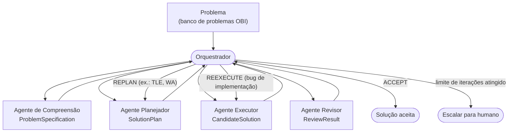

# Arquitetura multiagente: critérios técnicos e visão geral

Este documento define o que, tecnicamente, torna cada componente do
`polya-multiagent` um **agente** (e não apenas uma chamada de LLM
encapsulada em uma função), e como os quatro agentes — um por etapa do
método de Pólya — se encaixam em um sistema coordenado por um
orquestrador. É o documento de referência para quem for especificar ou
implementar qualquer um dos agentes ainda não construídos; cada um deles
tem seu próprio documento (`agente-*.md`, nesta mesma pasta) detalhando
entrada, saída e funcionamento.

## O que diferencia um agente de um chatbot

Um chatbot é `input → LLM → output`. Um agente, neste projeto, é definido
como um sistema que **percebe um estado, raciocina sobre um objetivo,
planeja ações, mantém estado entre etapas, executa e avalia o próprio
resultado**, repetindo esse ciclo até uma condição de término:

```
enquanto objetivo não alcançado:
    perceber(estado_atual)
    atualizar_estado()
    raciocinar()
    planejar()
    escolher_ação()
    executar()
    avaliar_resultado()
```

Formalmente, cada agente do pipeline mantém um estado
`S_t = {objetivo, contexto, memória, observações, restrições}`, produz
uma ação `a_t = π(S_t)` (onde `π` é implementada pelo LLM mais lógica
determinística de validação — nunca só o LLM sozinho, ver
["por que a revisão não pode ser só outro LLM dizendo OK"](agente-revisao.md#por-que-a-revisão-não-pode-ser-só-outro-llm-dizendo-ok)),
e recebe de volta uma observação `o_{t+1}` que atualiza `S_t`.

## Dez critérios de engenharia

Todo agente do pipeline — implementado ou planejado — deveria poder ser
avaliado contra estes dez critérios. Eles complementam, em nível de
engenharia, as cinco características de agente inteligente (autonomia,
reatividade, proatividade, aprendizado, comunicação) já detalhadas para o
Agente Planejador em
[`docs/agente-planejador/visao-geral.md`](../agente-planejador/visao-geral.md#características-de-agente-inteligente)
— aquele documento explica *como* uma característica foi implementada em
código; este aqui define o *checklist* que qualquer agente novo deveria
satisfazer antes de ser considerado pronto.

| # | Critério | Pergunta que ele responde | Onde isso aparece hoje |
|---|---|---|---|
| 1 | **Autonomia** | O agente completa uma sequência de ações sem uma nova instrução humana a cada passo? | `PlaninngAgent.plan()` roda as 4 etapas de Pólya sozinho — ver [`agente-planejador.md`](agente-planejador.md). |
| 2 | **Tool use** | O agente usa ferramentas (compilador, executor, busca) além do conhecimento paramétrico do LLM, e decide sozinho quando precisa de uma? | Ainda não há ferramentas externas no pipeline (só chamadas de LLM). Planejado para o [Agente Executor](agente-execucao.md) (compilador, runner de testes) e para o [Agente Revisor](agente-revisao.md) (fuzzer, oráculo). |
| 3 | **Planejamento** | O agente decompõe um objetivo em subtarefas antes de agir? | Etapa 2 de Pólya (`SolutionPlan`) — ver [`agente-planejador.md`](agente-planejador.md). |
| 4 | **Memória** | O agente recupera a informação certa no momento certo (curto prazo: estado da tarefa; longo prazo: histórico entre tentativas)? | Curto prazo: os campos tipados passados entre as 4 etapas dentro de uma chamada a `plan()`. Longo prazo: `PlannerInput.previous_attempts` + `replan()`. Não há memória entre problemas diferentes (cada `PlannerInput` é isolado). |
| 5 | **Gerência de estado** | O agente sabe em que ponto da tarefa está? | `PlannerOutput.iteration`; dentro de uma chamada, o encadeamento sequencial dos 4 estágios privados de `PlaninngAgent`. |
| 6 | **Feedback / autoavaliação** | O agente verifica o próprio resultado em vez de assumir que deu certo? | `PlanReview.trace_checks`, `.complexity_feasible`, `.justification_quality_issues` — checagens **determinísticas**, não o LLM se autoavaliando. Ver [`agente-planejador.md`](agente-planejador.md#as-quatro-métricas-de-planejar). |
| 7 | **Controle de execução** | Existem limites explícitos (passos, custo, tempo) que impedem loops indefinidos? | `timeout` no construtor de `PlaninngAgent`; `TokenUsage` reporta custo por chamada. Não há `max_iterations` para o ciclo `replan()` — é responsabilidade do Orquestrador (ver abaixo), hoje não implementado. |
| 8 | **Segurança** | Ações de risco (executar código, gastar dinheiro) exigem permissão/sandboxing proporcional ao risco? | Ainda não relevante — nenhum agente implementado executa código. Será central para o [Agente Executor](agente-execucao.md) (sandboxing do código gerado). |
| 9 | **Observabilidade** | Dá para responder "por que o agente fez isso?" depois do fato? | `TokenUsage` (modelo, tokens, custo, tempo) em cada `PlannerOutput`; `PlannerMalformedResponseError` carrega `.stage` e `.raw_response`. Não há um *trace* estruturado por execução ainda (ex.: um `run_id` unificando as 4 chamadas). |
| 10 | **Avaliação** | Existe uma forma de medir se o agente completa tarefas reais, não só "responde bem"? | Ainda não há um harness de avaliação no repositório (nenhum banco de problemas com gabarito integrado). As métricas por etapa estão definidas abaixo e em cada `agente-*.md`, prontas para quando esse harness existir. |

## Os quatro agentes e o Orquestrador

A metodologia de Pólya mapeia 1:1 em quatro agentes especializados,
coordenados por um Orquestrador que decide qual agente atua a seguir. O
fluxo **não é linear**: um resultado de revisão pode mandar de volta para
o planejamento (replanejar) ou para a execução (só corrigir um bug de
implementação, mantendo o plano).



| Agente | Etapa de Pólya | Status neste repositório | Documento |
|---|---|---|---|
| Compreensão | 1. Understand the problem | Fundido dentro do Agente Planejador (`_understand()`) | [`agente-compreensao.md`](agente-compreensao.md) |
| Planejador | 2. Devise a plan + 3. Carry out the plan (pseudocódigo) + 4. Look back (do plano) | **Implementado** (`PlaninngAgent`) | [`agente-planejador.md`](agente-planejador.md) → [`docs/agente-planejador/`](../agente-planejador/) |
| Executor | 3. Carry out the plan (código real) | Não implementado (stub `ExecutationAgent`) | [`agente-execucao.md`](agente-execucao.md) |
| Revisor | 4. Look back (pós-execução, sobre o código/veredito) | Não implementado (stub `ReviewAgent`) | [`agente-revisao.md`](agente-revisao.md) |

Note que a etapa 3 de Pólya aparece duas vezes na tabela: o Agente
Planejador já produz um **pseudocódigo** (para dar contexto extra ao
prompt de geração de código — ver
[`docs/agente-planejador/interface.md`](../agente-planejador/interface.md)),
mas quem produz o **código-fonte final, compilável**, é o Agente Executor.
São responsabilidades diferentes, mesmo pertencendo à mesma etapa de
Pólya.

Da mesma forma, "revisar" aparece em dois lugares diferentes do sistema e
**não devem ser confundidos**:

- `PlaninngAgent._look_back()` revisa o **plano**, antes de qualquer
  código existir (ex.: "essa complexidade cabe no limite de tempo?").
- O Agente Revisor (ainda não implementado) revisa o **resultado da
  execução**, depois que há código e (idealmente) um veredito do Judge
  (ex.: "por que esse código deu Wrong Answer, e o plano já tinha avisado
  disso?").

## Contratos entre agentes

| Contrato | Produzido por | Consumido por | Status |
|---|---|---|---|
| `ProblemSpecification` | Compreensão | Planejador | Hoje é `ProblemUnderstanding`, produzido *dentro* do Planejador — ver [`agente-compreensao.md`](agente-compreensao.md#mapeamento-com-o-código-atual). |
| `SolutionPlan` | Planejador | Executor | Implementado como `PlannerOutput` (`agents/plannig_agent/schemas.py`). |
| `CandidateSolution` | Executor | Revisor | Não implementado — especificado em [`agente-execucao.md`](agente-execucao.md#saída-candidatesolution). |
| `ReviewResult` | Revisor | Orquestrador | Não implementado — especificado em [`agente-revisao.md`](agente-revisao.md#saída-reviewresult). |
| `JudgeAttemptFeedback` | Judge (não implementado) | Planejador (via `replan()`) | Implementado (`agents/plannig_agent/schemas.py`) — já suportado pelo ciclo de feedback do Planejador, mesmo sem Judge real ainda. |

## O Orquestrador

O Orquestrador é quem decide, a cada passo, qual agente roda a seguir —
ele é o `π` de mais alto nível do sistema, implementando o critério 7
(controle de execução) da tabela acima: limite de iterações
(`max_steps`), custo (`max_cost` somando `TokenUsage.total_cost_usd` de
todas as chamadas) e tempo total.

Hoje **não existe um Orquestrador de verdade** no repositório — `main.py`
é um script linear de demonstração que chama `PlaninngAgent.plan()`
diretamente (ver [`docs/agente-planejador/integracao.md`](../agente-planejador/integracao.md)).
Quando os agentes Executor e Revisor existirem, o Orquestrador precisa de:

- Uma máquina de estados simples (`NextAction`: `RUN_COMPREHENSION` |
  `RUN_PLANNER` | `RUN_EXECUTOR` | `RUN_REVIEWER` | `ACCEPT` |
  `ESCALATE_HUMAN`), decidida a partir do `ReviewResult.recommended_action`
  (ver [`agente-revisao.md`](agente-revisao.md)).
- Um limite duro de iterações do ciclo Planejador↔Executor↔Revisor, para
  não repetir indefinidamente (ex.: 3 tentativas, depois `ESCALATE_HUMAN`).
- Agregação de `TokenUsage` de todos os agentes envolvidos em uma
  tentativa, para permitir medir custo por problema resolvido (métrica
  `Average Token Cost` mencionada abaixo).

## Métricas do sistema completo

Além das métricas por etapa (definidas em cada `agente-*.md`), o sistema
como um todo deveria ser avaliado por:

- **AC Rate** — problemas resolvidos corretamente / problemas submetidos
  ao Judge. É a métrica mais importante: o objetivo de todo o pipeline.
- **Average Attempts** — quantas vezes, em média, o ciclo
  Planejador↔Executor↔Revisor precisa iterar por problema.
- **Average Token Cost** e **Average Execution Time** — por problema
  resolvido, agregando `TokenUsage` de todos os agentes envolvidos.
- **Human Intervention Rate** — fração de problemas que precisaram de
  `ESCALATE_HUMAN`.

Nenhuma dessas métricas tem um harness de coleta automatizado no
repositório ainda — depende de existir um banco de problemas com gabarito
e um Judge real. Ver [`agente-execucao.md`](agente-execucao.md) e
[`agente-revisao.md`](agente-revisao.md) para as métricas por etapa, que
já valem mesmo sem esse harness (algumas, como as do Planejador, já são
calculadas em código hoje).
